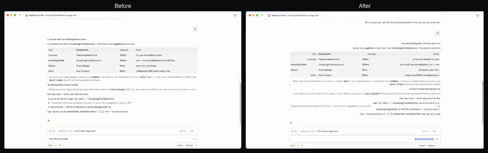
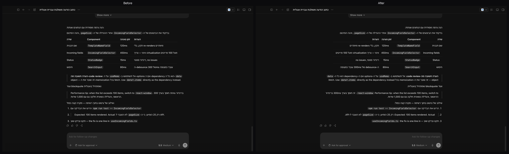

# desktop-rtl-llm

**Hebrew and Arabic finally render right in Claude Desktop and Codex Desktop.**

Chat in Hebrew with Claude or Codex on macOS and the UI fights you: sentences are
left-aligned, mixed Hebrew/English lines read out of order, list numbers jump from
side to side, punctuation lands on the wrong end of the sentence.

This project fixes that locally. A small bidi-aware runtime classifies every message
block and applies the right direction — while code blocks, inline code, file paths,
and URLs stay strictly LTR. No fork, no proxy, no cloud: the original apps are never
modified.

## Before / after

**Claude Desktop** — the original app vs. `Claude RTL.app`, same conversation:



**Codex Desktop** — before vs. after runtime injection:



## What you get

- **Per-block direction detection** — first-strong-character with a ratio fallback,
  so a Hebrew sentence that opens with `useQuery` still reads right-to-left
- **Code stays code** — fenced blocks, inline code, file paths, URLs, and JSON-like
  text are pinned LTR
- **Lists that don't zigzag** — mixed Hebrew/English lists keep a single marker
  column and consistent alignment
- **Tables, headings, blockquotes** — direction-aware, with app-specific fixes where
  the DOM needs them
- **RTL-aware composer** — the input box follows the first strong character of what
  you type
- **Local and reversible** — no network calls, no telemetry, plain readable JS/CSS;
  one command uninstalls

## Quick start

Requires macOS and Node 20+.

```bash
git clone https://github.com/nivdam/desktop-rtl-llm.git
cd desktop-rtl-llm
```

### Claude Desktop

```bash
./run-rtl.sh claude --install   # builds ~/Applications/"Claude RTL.app" (one time)
./run-rtl.sh claude             # launches it (auto-rebuilds after Claude updates)
```

The original `/Applications/Claude.app` keeps working untouched — use it for app
updates and for features that need Apple-issued entitlements (Cowork/Workspace).
Remove everything with `./run-rtl.sh claude --uninstall`.

### Codex Desktop

```bash
./run-rtl.sh codex              # launches/attaches and injects the runtime
```

No copied app needed; rerun the command after the app restarts.

## How it works

Two integration models, one shared runtime (`runtime/` + per-app `profiles/`):

- **Codex** — runtime injection over the DevTools protocol into the normally
  installed app.
- **Claude** — Claude's renderer can't be reached over CDP, so the installer builds
  a patched, ad-hoc-signed copy at `~/Applications/Claude RTL.app`. The patch lives
  in the Electron main process and reads the runtime, CSS, and profiles from this
  repo at every launch — changing them only requires an app restart.

The classifier is pure logic with tests (`node --test tests/*.test.mjs`) and covers
all RTL scripts (Hebrew, Arabic, Syriac, Thaana, N'Ko). Day-to-day testing happens
in Hebrew — issues and reports for other scripts are welcome.

Deep dives: [docs/RUNTIME.md](./docs/RUNTIME.md) ·
[docs/RUNNING.md](./docs/RUNNING.md) ·
[docs/LAUNCHERS.md](./docs/LAUNCHERS.md) ·
[docs/PLAN.md](./docs/PLAN.md)

## Good to know

- `profiles/*.local.json`, `logs/`, and `state/` are machine-local and git-ignored.
- `Claude RTL.app` is ad-hoc signed; macOS may re-prompt for Keychain access after a
  rebuild.
- Spotlight launchers ("Claude RTL Launcher" / "Codex RTL Launcher"):
  `node setup-launchers.mjs`.
- Tested against Claude Desktop 1.11847 and Codex Desktop 26.608. App DOM changes
  are absorbed in `profiles/*.json` selectors, not code rewrites.

## License

[MIT](./LICENSE)
